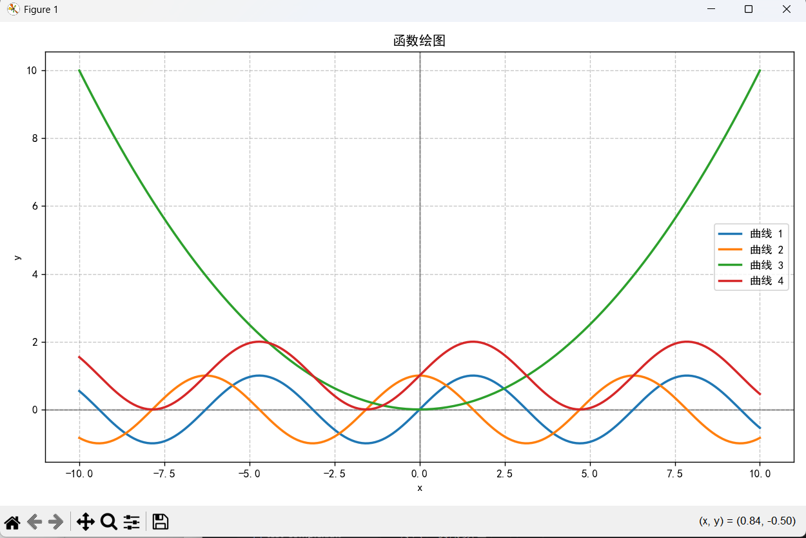
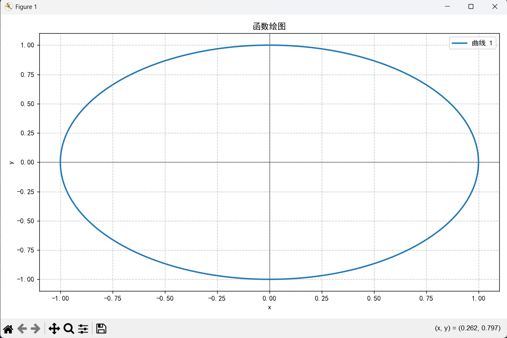

# Function Painter

一个功能强大的函数绘图语言解释器，支持多种数学函数和操作，帮助用户快速绘制和可视化数学函数图像。

## 功能特点

- 支持基本的数学运算：加、减、乘、除、取模、整除
- 支持常用数学函数：sin、cos、tan、exp、log、sqrt、abs等
- 支持变量定义和常量定义
- 支持表达式计算和绘制
- 支持参数范围自定义
- 支持多表达式同时绘制和颜色指定
- 支持数学常量：π(pi)、e
- 提供图像清空功能
- 完善的错误提示和异常处理

## 安装说明

### 依赖项

- Python 3.8+
- NumPy
- Matplotlib

### 安装步骤

1. 克隆或下载项目到本地
2. 安装必要的依赖：

```bash
pip install numpy matplotlib
```

## 使用方法

### 启动程序

在项目根目录下运行主程序，指定源文件路径：

```bash
# 方法一：直接运行main.py
python function_painter/main.py <源文件路径>

# 方法二：作为模块运行
python -m function_painter.main <源文件路径>
```

### 基本语法

#### 1. 参数范围定义（两种格式）

```
# 格式一：使用from...to...step语法
param x from -10 to 10 step 0.1

# 格式二：使用数组语法
param x[-10, 10, 0.1]
```

#### 2. 变量赋值
```
scale = 1.0
offset = 0.5
```

#### 3. 常量定义
```
const PI = 3.14159
const GRAVITY = 9.8
```

#### 4. 变量表达式定义
```
# 定义正弦函数表达式
f = sin(x)

# 定义复合函数表达式
g = sin(2 * x) + cos(3 * x)
```

#### 5. 绘制表达式
```
# 绘制单个表达式
param x from -5 to 5 step 0.1
draw sin(x)

# 指定颜色绘制
param t from 0 to 6.28319 step 0.01
draw cos(t) with red
draw sin(t) with blue

# 绘制多个表达式
param x from -3.14159 to 3.14159 step 0.01
draw sin(x), cos(x), tan(x)
```

#### 6. 图像控制
```
# 清空当前图像
clear

# 显示图像
show
```

### 支持的运算符
- `+` 加法
- `-` 减法
- `*` 乘法
- `/` 除法
- `%` 取模
- `//` 整除
- `^` 幂运算

### 支持的数学函数
- `sin(x)` 正弦函数
- `cos(x)` 余弦函数
- `tan(x)` 正切函数
- `asin(x)` 反正弦函数
- `acos(x)` 反余弦函数
- `atan(x)` 反正切函数
- `exp(x)` 指数函数
- `log(x)` 自然对数
- `log10(x)` 以10为底的对数
- `sqrt(x)` 平方根
- `abs(x)` 绝对值

### 内置常量
- `pi` 圆周率
- `e` 自然对数的底

## 使用示例

### 示例1：简单正弦函数绘制
```
param x from -10 to 10 step 0.1
draw sin(x)
show
```

### 示例2：多表达式复合绘制
```
param t from -1 to 1 step 0.01

# 直接在draw语句中使用表达式，确保每个点都重新计算
clear
draw sin(2 * t) with red
draw cos(3 * t) with blue
draw sin(2 * t) + cos(3 * t) with green
show
```

### 示例3：参数方程绘制
```
param t from 0 to 6.28319 step 0.01

# 定义圆的参数方程（支持下划线变量名）
x_coord = cos(t)
y_coord = sin(t)

# 绘制圆形
draw x_coord, y_coord with purple
show
```

### 示例4：复杂表达式组合
```
param x from -5 to 5 step 0.01

# 绘制多个表达式
draw sin(x) with red
draw cos(x) with blue
draw sin(x) * cos(x) with green
draw exp(-x^2/2) with orange  # 高斯函数
show
```

### 示例5：复杂函数图像展示

运行`python -m function_painter.main test_complex.txt`可以查看更复杂的函数图像组合，效果如下图所示：

复杂函数绘图示例
或者运行`python -m function_painter.main test_function.txt`等等。

*注：实际运行时请确保test_complex.txt文件存在且包含有效的绘图指令*

## 项目结构

```
function_painter/
├── __init__.py
├── main.py           # 主程序入口
├── interpreter.py    # 解释器核心
├── lexer/            # 词法分析器目录
│   ├── __init__.py
│   ├── lexer.py
│   ├── text_reader.py
│   └── token_manager.py
├── parser/           # 语法分析器目录
│   ├── __init__.py
│   └── parser.py
├── drawer/           # 绘图模块
│   ├── __init__.py
│   └── drawer.py
└── exception/        # 异常处理
    ├── __init__.py
    └── exception.py
```

## 错误处理

程序会捕获并显示以下类型的错误：

- 词法错误：无效的字符或符号
- 语法错误：语法结构不正确
- 语义错误：变量未定义、函数参数不匹配等
- 运行时错误：除零、非法操作等
- 文件错误：文件未找到、格式错误等

## 图像示例说明

在运行程序时，系统会根据输入的表达式生成对应的函数图像。对于复杂的函数组合，可以通过查看生成的图像直观了解函数的行为和特性。上图展示了多个函数曲线在同一坐标系中的对比效果，包括不同周期和振幅的正弦、余弦函数及其组合。

## 注意事项

- 函数参数名通常使用单个字母（如x、t等）
- 绘制表达式时，如果未指定颜色，系统将自动分配颜色
- 避免在绘图范围内出现无穷大或NaN值，可能导致绘图错误
- 参数范围过大或步长过小可能导致绘图缓慢，请合理设置范围和步长
- 支持单行注释，使用//开头
- **重要说明**：当使用变量赋值表达式（如 `f = sin(x)`）时，表达式只在赋值时计算一次，不会随参数变化而重新计算。如需绘制随参数变化的曲线，请直接在draw语句中使用表达式。

## 许可证

本项目采用MIT license。